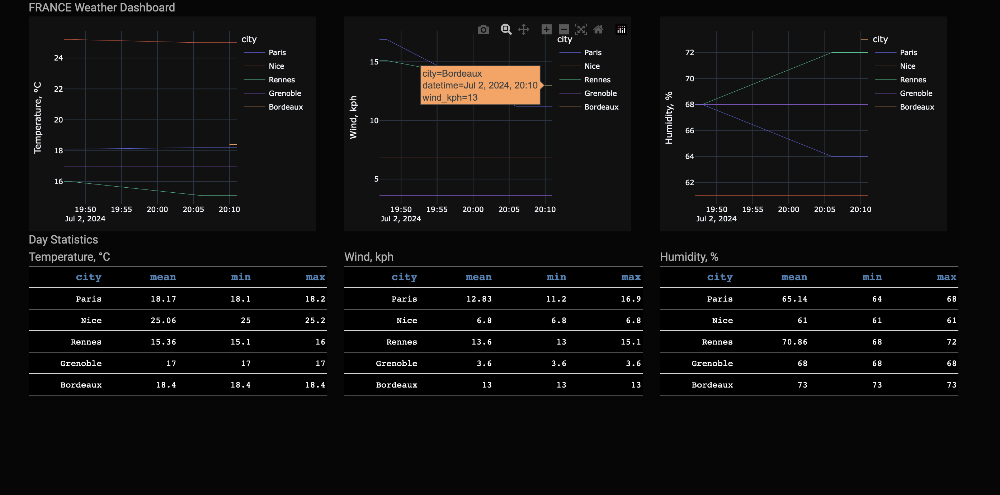

# TP : Plateforme de Streaming de Données en Temps Réel avec Apache Kafka 


## Run the project

```bash
git clone ...

cd kafka_TP

docker compose up -d --build
```

To stop the execution:

```bash
docker compose down
```

Go to http://0.0.0.0:8050 to see the DashBoard

## Description of the project

This is a Python/Dash platform that streams weather data and displays it online.




Every minute 5 api calls are made in order to obtain weather data (temperature, wind velocity and humidity)
for 5 cities: Paris, Rennes, Bordeaux, Nice, Grenoble.

There are 5 kafka topics, 5 producers and 5 consumers.

The consumers save the data to mongodb database (one collection for all the messages from 5 consumers).

The Dash/Plot application make a call every minute to update the traces and table statistics (mean, min and max values ***for the current day***).

There are 4 docker containers:
1. one for zookeeper
2. one for kafka
3. one for mongodb
4. one for python execution environment

The pyhton execution environment is threaded:
1. 5 threads for 5 consumers
2. 5 threads for 5 producers
3. 1 thread for Dash/Plotly application

The graphs on dashboard are updated every minute (a call is made to a mongo database).

### ATTENTION! The app is running on host 0.0.0.O, thus allowing all connections, which is not secure. The use of the application is at your own risk
